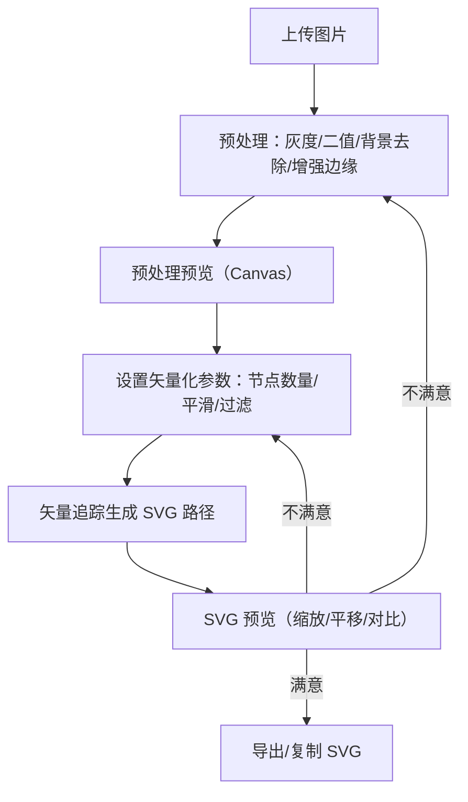

## 1. 产品概述
一个离线运行的网页工具：用户上传照片/草图/截图后，先进行可调的图像预处理，再将结果追踪为干净、可编辑、分层组织的 SVG 路径，并支持控制矢量节点数量与导出。
- 解决问题：把位图快速变成可编辑的矢量路径，避免手工描摹；同时保留对“黑白化/阈值/边缘清晰度/节点密度”的可控性
- 目标用户：设计师、前端、产品/运营、插画爱好者、需要将截图/草图转为矢量资产的人

## 2. 核心功能

### 2.1 功能模块
1. **单页工作台**：上传/拖拽图片、参数调节、预览、导出
2. **预处理控制**：黑白化、阈值/对比度、背景去除、边缘增强与平滑
3. **矢量化控制**：追踪生成 SVG、节点数量/简化强度、分层组织、导出下载
4. **结果对比与回退**：原图/预处理图/SVG 预览切换，参数变更后可重复生成

### 2.2 页面详情
| 页面名称 | 模块名称 | 功能描述 |
|---|---|---|
| 工作台 | 上传区 | 点击选择/拖拽上传；展示文件信息；支持替换图片 |
| 工作台 | 预处理参数 | 黑白模式（灰度/二值）、阈值、对比度、背景去除强度、边缘增强、轻度去噪；实时渲染预处理预览 |
| 工作台 | 矢量化参数 | 节点数量（低/中/高或滑杆）、平滑度、最小斑点过滤（去小噪点）；点击“生成 SVG” |
| 工作台 | 预览区 | 三分栏或切换：原图、预处理图（Canvas）、SVG（可缩放/平移）；显示基础统计（路径数、节点数估计） |
| 工作台 | 导出区 | 导出 SVG 文件（含分层分组）；复制 SVG 文本；下载 |

## 3. 核心流程
用户主流程：
1. 上传图片
2. 调整预处理参数，得到更清晰的黑白/边缘结果
3. 调整矢量化参数（节点数量/简化强度），生成 SVG
4. 预览不满意则回到第 2 或第 3 步继续调参
5. 导出 SVG

## 4. 用户界面设计
### 4.1 设计风格
- 整体：深色工作台 + 高对比的“实验室仪表盘”风格，强调可视化与参数可控
- 主色/辅色：中性深灰（背景）+ 高饱和青绿（交互强调）+ 柔和橙色（警告/提示）
- 字体：标题使用更具几何感的展示字体，正文使用易读的无衬线；数值采用等宽字体提升“参数面板”质感
- 组件：滑杆/切换/数值输入并行；参数区采用分组卡片；预览区提供缩放与网格背景

### 4.2 页面设计概览
| 页面名称 | 模块名称 | UI 元素 |
|---|---|---|
| 工作台 | 上传区 | 拖拽态、文件缩略图、替换按钮、示例提示 |
| 工作台 | 参数区 | 分组卡片、滑杆带数值、预设（照片/草图/截图）快速切换 |
| 工作台 | 预览区 | 视图切换（原图/预处理/SVG/对比），缩放平移，棋盘格透明背景 |
| 工作台 | 导出区 | 下载按钮、复制按钮、导出选项（文件名、是否内联样式） |

### 4.3 响应式
- 桌面优先：默认左右布局（左侧参数、右侧预览）
- 小屏：上下布局；预览区优先展示；参数折叠为手风琴

