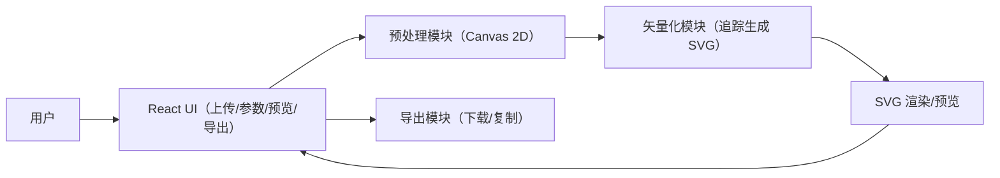

## 1. 架构设计
前端纯本地处理：图片读入后在 Canvas 内做预处理（灰度/二值/增强），矢量化阶段在浏览器端生成 SVG 字符串并渲染预览，不依赖外部服务。



## 2. 技术说明
- 前端：React@18 + TypeScript + tailwindcss@3 + vite
- 状态管理：zustand（存储当前图片、预处理参数、矢量化参数、生成结果与统计）
- 图像预处理：Canvas 2D（像素级处理：灰度、阈值二值化、对比度、简易背景去除、边缘增强/轻度模糊）
- 矢量化/追踪：
  - 默认采用浏览器端的 JS 矢量追踪库（例如 ImageTracer 风格的“位图→路径”追踪）
  - 节点数量控制映射为“路径简化/省略点/分辨率阈值”等参数组合
- 无后端：默认不提供上传到服务器、账号与存储

## 3. 路由定义
| 路由 | 用途 |
|---|---|
| / | 单页工作台（上传、调参、预览、导出） |

## 4. 关键数据结构（前端）
```ts
export type PreprocessParams = {
  mode: "grayscale" | "binary"
  threshold: number
  contrast: number
  backgroundRemoval: number
  edgeEnhance: number
  denoise: number
}

export type VectorizeParams = {
  nodeDensity: number
  smoothing: number
  speckleFilter: number
}

export type VectorizeResult = {
  svgText: string
  pathCount: number
  estimatedNodeCount: number
}
```

## 5. 模块拆分（前端）
- src/pages/Workspace：整体布局与流程编排
- src/components/Uploader：上传/拖拽与图片解码
- src/components/PreprocessPanel：预处理参数与预览联动
- src/components/VectorizePanel：矢量化参数与生成触发
- src/components/PreviewStage：原图/预处理/SVG 预览（缩放平移）
- src/utils/image/preprocess：Canvas 像素处理管线
- src/utils/vectorize/trace：追踪与 SVG 组装
- src/utils/svg/analyze：统计路径/节点数量（用于 UI 展示）

## 6. 性能与约束
- 图片尺寸限制：默认对超大图像自动缩放到最大边长（例如 1600px）以保证交互流畅
- 生成阶段异步化：矢量化计算采用分段执行/可取消（避免阻塞 UI）
- 隐私：所有处理在本地进行；不记录、不上传用户图片

