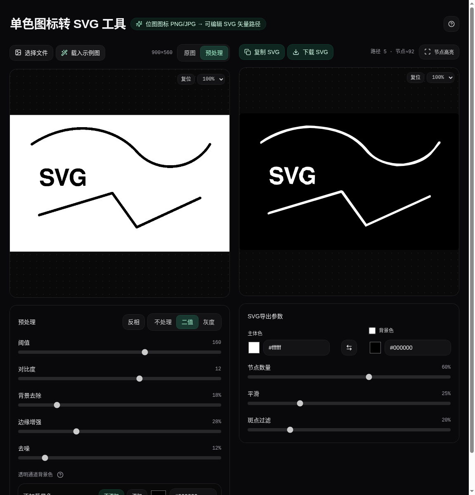

# 单色图标转 SVG 工具

位图图标 PNG/JPG → 可编辑 SVG 矢量路径。一个纯前端的「图片 → 可编辑 SVG」矢量追踪工具：左侧做预处理，右侧自动生成 SVG，并支持节点高亮、复制/下载导出。



## 特性

- 双栏工作台：左侧预处理预览，右侧 SVG 预览，缩放与拖动视野同步
- 导入即生成：上传/拖入/粘贴图片后自动生成 SVG
- 预处理能力：二值/灰度、反相、阈值、对比度、背景去除、边缘增强、去噪、添加背景色（透明 PNG）
- 可控矢量化：节点数量、平滑、斑点过滤、前景/背景色
- 节点高亮：叠加显示路径节点，便于检查与调参
- 一键导出：复制 SVG 文本 / 下载 .svg 文件

## 使用步骤

1. 导入图片：点击“选择文件”，或直接拖入图片到左侧预览区，也可粘贴剪贴板图片
2. 左侧预处理：优先把图片处理成“适合追踪”的黑白/灰度效果
3. 右侧调矢量化：节点数量、平滑、斑点过滤与颜色会自动触发重新生成
4. 导出：复制 SVG 或下载 SVG

## 透明 PNG 建议

- 白色图标 + 透明背景：通常保持默认“添加背景色 = 黑色”，更容易得到有效形状
- 深色图标 + 透明背景：可把“添加背景色”设为白色，以增强主体与背景对比
- 无透明通道图片：默认不启用“添加背景色”

## 本地开发

### 环境要求

- Node.js 18+（建议 20+）
- pnpm

### 启动

```bash
pnpm install
pnpm dev
```

### 常用命令

```bash
pnpm check   # TypeScript 类型检查
pnpm build   # 生产构建
pnpm preview # 预览构建产物
```

## 技术栈

- React + TypeScript + Vite
- Zustand（状态管理）
- Tailwind CSS（样式）
- imagetracerjs（矢量追踪）
- lucide-react（图标）

## 目录结构（节选）

```text
src/
  components/         UI 组件（预处理面板、预览、缩放拖拽等）
  pages/              页面（Home）
  store/              Zustand store
  utils/
    image/            预处理（阈值/去噪/边缘增强/添加背景色等）
    vectorize/        矢量化（生成 SVG）
    svg/              SVG 分析/节点高亮/清理
  assets/test-icons/  测试图标素材
```

## 测试素材

仓库内置了一些测试用 PNG（包含透明通道案例），位于：

- `src/assets/test-icons/`

## License

请在发布到 GitHub 时根据你的需求添加许可证（如 MIT）。当前仓库未内置 License 文件。
